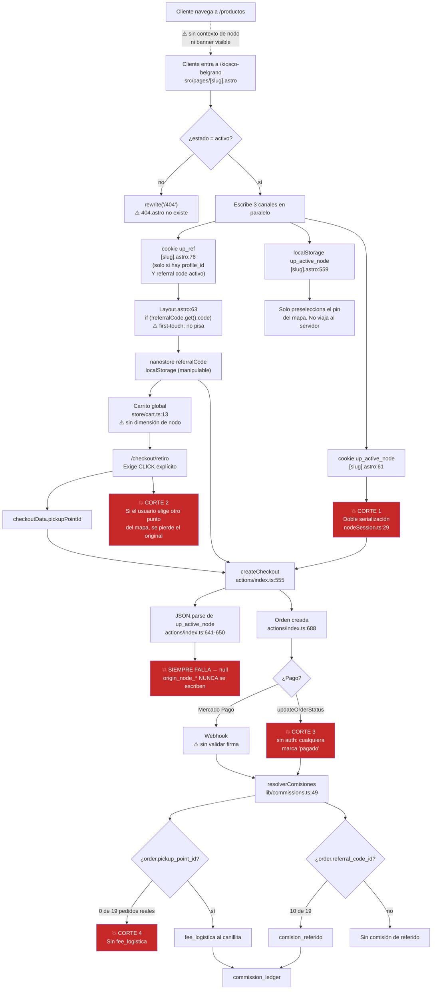

# Trazabilidad: de la página del punto al asiento de comisión

Recorrido real del dato **tal como está hoy**, no como debería ser. Cada punto de corte está marcado y verificado.

---

## Diagrama del flujo actual



---

## Los cuatro cortes, en detalle

### Corte 1 — La cookie de nodo nunca se puede leer *(crítico, verificado)*

`serializeActiveNodeCookie()` devuelve un **header `Set-Cookie` completo**:

```
up_active_node=%7B%22id%22...%7D; Path=/; Max-Age=2592000; SameSite=Lax
```

pero `src/pages/[slug].astro:61` lo pasa como el **valor** a `Astro.cookies.set()`. Astro vuelve a codificar todo el string, así que al leerlo se obtiene un texto que empieza con `up_active_node=…` y no es JSON.

```
JSON.parse(decodeURIComponent(valor))
  → SyntaxError: Unexpected token 'u', "up_active_"... is not valid JSON
```

**Consecuencia:** `activeNodeSession = null` en `createCheckout`, y los campos `origin_node_id`, `origin_node_name`, `origin_slug`, `origin_canillita_id` **nunca se escriben**.

**Evidencia en producción:** de **19 pedidos reales, 19 tienen `origin_node_id = null`.** Nunca funcionó.

Efectos colaterales del mismo bug: el banner "Estás comprando en X" (`Layout.astro:29-37`), el banner del checkout (`retiro.astro:80-98`) y el redirect al nodo después del login (`login.astro:37`) tampoco funcionan nunca.

**Test que lo prueba:** `tests/unit/nodeSession.test.ts` (3 fallos hoy).

---

### Corte 2 — El punto de retiro depende de un click manual *(crítico, verificado)*

El único canal que realmente llega a la orden como `pickup_point_id` es `checkoutData.pickupPointId`, y **solo se escribe cuando el usuario hace click en "Retirar en este punto"** (`checkout/retiro.astro:317`).

Si el usuario elige otro punto en el mapa, la preselección se pierde **sin ninguna advertencia**. Y como el banner de nodo activo no se renderiza (Corte 1), no tiene forma de saber que estaba comprando "en" un punto.

**Evidencia en producción:** de **19 pedidos, 19 tienen `pickup_point_id = null`.** Ningún pedido tiene punto de retiro asignado.

---

### Corte 3 — El estado "pagado" no está protegido *(crítico)*

`updateOrderStatus` (`src/actions/index.ts:1093-1137`) **no valida `ctx.locals.user`**. Las Astro Actions son endpoints POST directos y el middleware solo filtra por `pathname.startsWith('/admin')`.

Cualquiera puede hacer `POST /_actions/updateOrderStatus` con `{orderId, nuevoEstado:"confirmado"}` y disparar `resolverComisiones()` — es decir, **acreditar comisiones reales sin que exista pago**.

El webhook (`api/webhooks/mercadopago.ts`) tampoco valida firma, y si falta `MP_ACCESS_TOKEN` acepta que el `paymentId` sea directamente el `orderId`.

---

### Corte 4 — Sin punto de retiro no hay fee de logística *(consecuencia de 1 y 2)*

`resolverComisiones` (`lib/commissions.ts:75-80`) deriva el canillita de logística desde `order.pickup_point_id`. Como ese campo es `null` en el 100% de los pedidos, esa rama **nunca se ejecuta**.

---

## Lo que sí funciona (parcialmente)

La **única** vía de atribución viva hoy es el código de referido por `?ref=` → `localStorage` → `createCheckout`:

```
?ref=CANI-XXX  →  Layout.astro:51  →  nanostore referralCode
               →  pago.astro:261   →  createCheckout
               →  actions:582-590  →  orders.referral_code_id
```

**10 de 19 pedidos tienen `referral_code_id`.** Pero:

- Vive en `localStorage`, **manipulable**: cualquiera puede escribir el código de otro canillita.
- Es **first-touch** (`Layout.astro:63`), mientras la cookie de nodo es **last-touch** (`[slug].astro:61`). Entrar por A y después por B hace que **A cobre el referido y B el fee de logística**. Nadie decidió esa regla: es un accidente.
- Un `?ref=` **siempre pisa** al referido del nodo, pero el referido de un nodo nunca pisa a otro. Un canillita que difunda su link puede **robar la atribución** de cualquier nodo visitado antes.

**Dato llamativo, no explicado:** hay 10 pedidos con `referral_code_id` y **0 asientos `comision_referido`** en el ledger. Los 6 asientos existentes son todos `fee_logistica`, pese a que ningún pedido tiene `pickup_point_id`. Sospecho que provienen de `scripts/seed-commissions.ts`, pero **no lo confirmé**.

---

## Aislamiento entre canillitas

**En la página del punto (`/[slug]`): no hay fuga.** El catálogo es global e idéntico para todos; no se renderiza información de otros puntos ni de sus clientes o comisiones. La variable `pickupPoints` de `[slug].astro:90` queda asignada pero nunca se usa.

**Pero el aislamiento se rompe fuera de esa página:**

1. `/checkout/retiro` (público, sin login) embebe en el HTML el `profile_id`, teléfono y condición fiscal de **todos** los canillitas (`retiro.astro:41-43,213`). Ese `profile_id` es la clave de `commission_ledger` y `payouts`.
2. Las colecciones `orders`, `payouts`, `commission_ledger` y `pickup_points` son **legibles anónimamente desde internet** (verificado con `curl`). Cualquier canillita puede ver las comisiones y liquidaciones de todos los demás, y los CBUs.

---

## Cómo debería quedar el flujo

```mermaid
flowchart LR
    A["/kiosco-belgrano"] --> B["Cookie httpOnly firmada<br/>{nodeId, canillitaId, ts}"]
    B --> C["Middleware la valida<br/>en cada request"]
    C --> D["Banner persistente<br/>'Comprando en X'"]
    D --> E["Carrito con nodo asociado"]
    E --> F["Checkout: punto pre-elegido<br/>cambiarlo es explícito y avisado"]
    F --> G["createCheckout lee la cookie<br/>del SERVIDOR, no de localStorage"]
    G --> H["orders.pickup_point_id<br/>+ origin_node_id"]
    H --> I["Webhook con firma validada<br/>+ idempotencia por payment_id"]
    I --> J["resolverComisiones<br/>idempotente por order_id"]
    J --> K["commission_ledger<br/>append-only"]

    style B fill:#2e7d32,color:#fff
    style I fill:#2e7d32,color:#fff
    style K fill:#2e7d32,color:#fff
```



**Cambios de fondo, más allá de arreglar los bugs:**

1. **Una sola fuente de verdad para la atribución**, del lado del servidor y firmada. Hoy hay **seis canales** en paralelo (`up_ref_code` — que nadie lee —, `up_ref`, `up_active_node` cookie, `up_active_node` localStorage, nanostore `referralCode`, `checkoutData.pickupPointId`) y ninguno es autoritativo.
2. **La atribución no puede vivir en `localStorage`**: es manipulable y ahí se decide plata real.
3. **Política de atribución escrita y explícita** (first-touch vs last-touch, ventana, qué gana entre nodo y `?ref=`). Hoy es emergente y contradictoria.
4. **Ledger append-only de verdad.** Hoy `cancelarOrdenYRestaurarStock` hace `updateDocument` sobre asientos existentes (`lib/commissions.ts:195`), lo que rompe la auditabilidad: habría que insertar un asiento de reversa, no mutar el original.
5. **Idempotencia por `payment_id`**, no solo por `order_id`, para que reprocesar un webhook nunca duplique.
